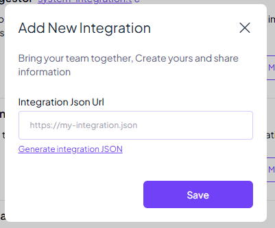

# Windows Server Health Checker

This project is a FastAPI-based application that connects to a Windows Server using SSH and retrieves various health metrics such as CPU usage, memory usage, disk usage, and network usage. The results are then sent to [Telex](https://telex.im/).

## Table of Contents

- [Features](#features)
- [Requirements](#requirements)
- [Setup](#setup)
- [Usage](#usage)
- [Testing](#testing)
- [Deployment](#deployment)
- [Contributing](#contributing)
- [License](#license)

## Features

- Connects to a Windows Server using SSH
- Retrieves CPU usage, memory usage, disk usage, and network usage
- Sends the results to a specified channel on [Telex](https://telex.im/)
- Asynchronous processing using FastAPI and BackgroundTasks

## Requirements

- Python 3.8+
- FastAPI
- Paramiko
- HTTPX
- Pytest (for testing)

## Periquisites

- Create a [Telex](https://telex.im/) account
- Create an organization
- Create a channel
- Note channel ID

## Setup

1. **Clone the repository:**

   ```sh
   git clone https://github.com/yourusername/Windows_Server_Health_Checker.git
   cd Windows_Server_Health_Checker
   ```

2. **Create a virtual environment:**

   ```sh
   python -m venv venv
   source venv/bin/activate  # On Windows, use `venv\Scripts\activate`
   ```

3. **Install the dependencies:**

   ```sh
   pip install -r requirements.txt
   ```

## Usage

1. **Run the FastAPI application:**

   ```sh
   uvicorn main:app --reload
   ```

2. **Add /integration to your integrations on Telex:**

   

   NB: /integration should return a json as seen below

   ```json
        {
        "date": {
                "created_at": "2025-02-18",
                "updated_at": "2025-02-18"
            },
            "descriptions": {
                "app_name": "Windows Server Health Checker",
                "app_description": "Monitor the performance of a Windows Server",
                "app_logo": "https://i.imgur.com/bRoRB1Y.png",
                "app_url": f"{base_url}",
                "background_color": "#fff"
            },
            "is_active": False,
            "integration_type": "interval",
            "key_features": [
                "- Monitor the performance of a Windows Server",
                "- NB: This integration is only for Windows Servers"
                "- NB: Ensure that SSH is enabled on the Windows Server"
            ],
            "integration_category": "Monitoring & Logging",
            "author": "Chidubem Nwabuisi",
            "website": f"{base_url}",
            "settings": [
                {
                    "label": "Server_IP",
                    "type": "text",
                    "required": True,
                    "default": "",
                },
                {
                    "label": "username",
                    "type": "text",
                    "required": True,
                    "default": "",
                },
                {
                    "label": "password",
                    "type": "text",
                    "required": True,
                    "default": "",
                },
                {
                    "label": "interval",
                    "type": "text",
                    "required": True,
                    "default": "* * * * *",
                }
            ],
            "tick_url": f"{base_url}/tick",
    }

   ```

3. **Send a POST request to the `/health` endpoint to test integration to call to Telex:**

   You can use tools like `curl`, `Postman`, or any HTTP client to send a POST request to the `/health` endpoint with the required payload.

   Example payload:

   ```json
   {
   	"channel_id": "your_telex_channel_id",
   	"return_url": "https://ping.telex.im/v1/return/<your-test-telex-channel-id>",
   	"settings": [
   		{
   			"label": "server_ip",
   			"type": "string",
   			"required": true,
   			"default": "127.0.0.1"
   		},
   		{
   			"label": "username",
   			"type": "string",
   			"required": true,
   			"default": "your_username"
   		},
   		{
   			"label": "password",
   			"type": "string",
   			"required": true,
   			"default": "your_password"
   		},
   		{
   			"label": "interval",
   			"type": "text",
   			"required": true,
   			"default": "* * * * *"
   		}
   	]
   }
   ```

## Testing

1. **Install the testing dependencies:**

   ```sh
   pip install pytest
   ```

2. **Run the tests:**

   ```sh
   pytest
   ```

   This will execute the test cases and provide you with the results.

## Deployment

1. Deployement was done to render.com for HTTPs communication

## Contributing

Contributions are welcome! Please open an issue or submit a pull request for any improvements or bug fixes.

## License

This project is licensed under the MIT License. See the LICENSE file for details.
